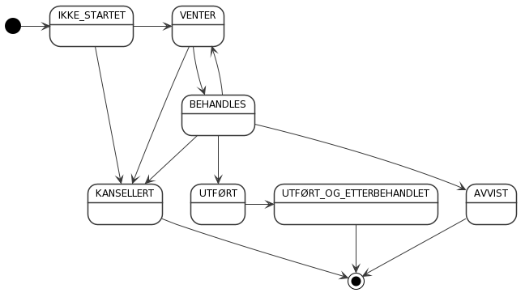

## Introduksjon til endringssett

Endringssett-endepunktet gjør det mulig å registrere og vedlikeholde vegobjekter og vegnett i NVDB. Siden vegnett
bare kan leveres fra spesifikke vegnettsklienter fokuserer denne API-dokumentasjonen kun på vegobjekter.

Et endringssett beskriver hvilke operasjoner som skal utføres på vegobjektene. Slike operasjoner kan være registrering,
oppdatering (versjonering), korrigering (feilretting), lukking og fjerning. Når endringssettet behandles gjennomgår det
en rekke validerings- og kontrolltrinn før det eventuelt blir godkjent og effektuert i NVDB. Alle vegobjekter og deres egenskaper sjekkes
mot kravene i datakatalogen. I tillegg kontrolleres at innholdet i endringssettet ikke kommer i konflikt med eksisterende
data i NVDB. Endringssett som bryter noen av disse reglene blir avvist og klienten kan i slike tilfeller hente ut detaljerte
beskrivelser av valideringsfeil for å presentere til brukeren i en eller annen form.

### Asynkron behandling

Flere av behandlingstrinnene krever oppslag i eksisterende data i NVDB og vil derfor kunne ta noe tid, spesielt for
klienter som registrerer eller oppdaterer mange vegobjekter samtidig. I tillegg vil selve skrivingen til NVDB også ta tid.
Videre vil noen oppdateringer ikke kunne skje umiddelbart fordi data i NVDB er låst av andre klienter. Store, komplekse endringssett
kan derfor ta flere minutter å behandle. Dersom APIet må vente på låser kan behandlingstiden i verste fall strekke seg over flere dager.

En konsekvens av lang behandlingstid er at endringssett må eksekveres _asynkront_. Dette innebærer at når klienten sender en request om
behandling av et endringssett, gjøres dette i en separat prosess i NVDB API Skriv som ikke blokkerer klienten. Responsen
fra requesten kommer umiddelbart og inneholder URLer som kan brukes til å hente behandlingsstatus i etterkant.

### Samhandling mellom klient og API

Sekvensdiagrammet under angir hvordan en klient skal kommunisere med APIet for å registrere, starte behandling av og innhente status for et endringssett:

Arbeidsflyten i et "happy day"-scenario består av følgende steg:

1. Klienten registrerer et nytt endringssett med en POST-request til /nvdb/apiskriv/rest/v3/endringssett. APIet kontrollerer at
det er _velformet_, det vil si syntaktisk og semantisk korrekt oppbygd. I så fall blir det lagret i en intern database i APIet og gitt en
_universelt unik identifikator_ ([UUID](https://en.wikipedia.org/wiki/Universally_unique_identifier)).

2. APIet responderer med en payload som inneholder URIer for de ulike aksjonene som kan utføres på den registrerte endringssett-ressursen.
Typiske aksjoner kan være _starte behandling_, _kansellere_, _hente behandlingsfremdrift_ m.fl. URIene er på formen /nvdb/apiskriv/rest/v3/endringssett/{id}/{aksjon},
der {id} markerer endringssettets tildelte identifikator.

3. Klienten ber om at behandling starter med en POST-request uten payload til /nvdb/apiskriv/rest/v3/endringssett/{id}/start.

4. APIet legger endringssettets id i kø for behandling i en separat prosess og responderer deretter med samme type payload som i steg 2.

5. Endringssettet hentes fra APIets database og behandling starter. Dersom endringssettet kommer helskinnet gjennom alle valideringer blir
det effektuert i NVDB.

6. Klienten poller jevnlig på APIet for å innhente behandlingsfremdrift ved å sende en GET-request til /nvdb/apiskriv/rest/v3/endringssett/{id}/fremdrift.
Gitt normal behandlingstid er polling oftere enn én gang i sekundet lite hensiktsmessig.

7. APIet innhenter gjeldende fremdriftskode for endringssettet og responderer med denne.

8. Klienten ser at fremdriftskoden fra APIet indikerer at endringssettet er ferdigbehandlet og ber om komplett behandlingsstatus med en
GET-request til /nvdb/apiskriv/rest/v3/endringssett/{id}/status.

9. APIet innhenter detaljert status for endringssettet, inkludert valideringsfeil dersom det ble avvist. Hvis endringssettet ble godkjent
og inneholder registrering av nye vegobjekter vil status inneholde de tildelte id'ene for disse vegobjektene i NVDB. APIet responderer med innhentet
status-informasjon.

Forløpet demonstreres grafisk i NVDB API Skriv sin innebygde testklient, [Generator](generator.md). Velg f.eks. test case 1 og klikk **Send** for å initiere
samme forløp som i sekvensdiagrammet over. 

Arbeidsflytens kompleksitet krever at klienter som integrerer med NVDB API Skriv må realisere en form for porteføljeovervåking som gjør det enkelt
for brukeren å følge med på behandlingen av sine endringssett og inspisere behandingsresultatet dersom noen ble avvist. I sin enkleste form
kan en slik porteføljeovervåking realiseres som en lenke til endringssettet i NVDB API Skriv sitt [Kontrollpanel](kontrollpanel.md):
/nvdb/apiskriv/kontrollpanel/#/jobs/view/{id}

### Koder for behandlingsfremdrift

Et endringssett vil før, under og etter behandling gå gjennom ulike tilstander representert som fremdriftskoder:

Fremdriftskode|Beskrivelse
-|-
IKKE_STARTET|Endringssettet er blitt registrert, men klienten har foreløpig ikke gitt ordre om å starte behandling.
BEHANDLES|Endringssettet er under behandling.
VENTER|Behandling er stoppet inntil videre, som regel på grunn av hindringer i NVDB. Behandlingen vil bli forsøkt gjenopptatt automatisk.
AVVIST|Behandlingen er avsluttet uten at endringssettet er effektuert i NVDB. Én eller flere valideringsfeil ble funnet.
UTFØRT|Behandlingen er avsluttet og endringssettet er effektuert i NVDB.  
UTFØRT_OG_ETTERBEHANDLET|Oppdateringene i NVDB er fanget opp av indekseringsmotoren og er tilgjengelig via endepunktene til NVDB API Les.
KANSELLERT|Behandlingen av endringssettet er kansellert. Endringssettet vil etterhvert kunne bli slettet.

Transisjonene mellom fremdriftskodene kan skisseres i et tilstandsdiagram slik:

### Hvor ofte skal klienten polle?
 
Når og hvor ofte klienten skal polle på endringssettets fremdrift er avhengig av den gjeldende fremdriftskoden. Følgende nøkkel anbefales:

Fremdriftskode|Ventetid før neste polling
-|-
IKKE_STARTET|Ingen polling.
BEHANDLES|1 sekund.
VENTER|1 sekund dersom endringssettet ikke har vært innom BEHANDLES, ellers 1 minutt.  
AVVIST|Teminaltilstand, ingen polling.
UTFØRT|1 minutt dersom klienten skal hente ut data fra NVDB API Les, ellers ingen polling.  
UTFØRT_OG_ETTERBEHANDLET|Teminaltilstand, ingen polling.
KANSELLERT|Teminaltilstand, ingen polling.
