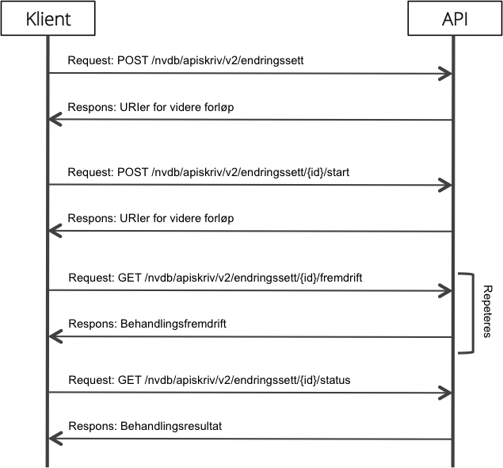
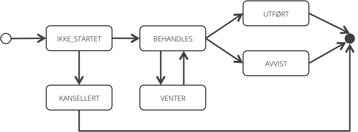

# Overblikk over NVDB API Skriv

Denne presentasjonen krever kjennskap til NVDBs datamodell inkludert metadata som beskrevet i datakatalogen.

## Docker
Det er mulig å starte en versjon av [API skriv lokalt med Docker](https://hub.docker.com/repository/docker/nvdbapnevegdata/nvdb-api-skriv).
Dette gjør det enkelt å prøve ut og integrere klienter under utvikling uten å ha tilgang til driftsmiljøer hos Statens vegvesen.

## Hovedprinsipper

NVDB API Skriv har følgende kjennetegn:

* Basert på REST-prinsipper
* Støtter både XML og JSON
* Asynkront, status innhentes ved polling
* Tilbyr CRUD-operasjoner på vegobjekter i NVDB via endringssett

## Endringssett

Den sentrale adresserbare ressursen i APIet er _endringssett_. All registrering, oppdatering, sletting og korrigering av
vegobjekter skjer via et endringssett som POSTes til /nvdb/apiskriv/v2/endringssett.

```xml
<endringssett datakatalogversjon="2.04" effektDato="2015-09-25">
   <registrer>
      ...
   </registrer>
   <oppdater>
      ...
   </oppdater>
   <slett>
      ...
   </slett>
   <korriger>
      ...
   </korriger>
</endringssett>
```

Et endringssett kan inneholde alle CRUD-elementene om ønskelig. På rotelementet må følgende attributter angis:

* **datakatalogversjon** - Angir datakatalogversjonen klienten har benyttet. Det gis advarsel dersom denne ikke er gjeldende versjon i NVDB.
* **effektDato** - Angir hvilken dato endringene gjelder fra. Denne tolkes ulikt avhengig av operasjon:
  * Registrer: Brukes som startdato for nye vegobjekter
  * Oppdater: Brukes som sluttdato for forrige versjon og startdato for ny versjon
  * Slett: Brukes som sluttdato for gjeldende versjon
  * Korriger: Ingen betydning

### Endringssett - Registrer

```xml
...
<registrer>
   <vegObjekter>
      <vegObjekt typeId="581" tempId="tunnel1">
         <assosiasjoner>
            ...
         </assosiasjoner>
         <egenskaper>
            ...
         </egenskaper>
         <lokasjon>
            ...
         </lokasjon>
      </vegObjekt>
      ...
   </vegObjekter>
</registrer>
...
```

Registrer-elementet definerer en eller flere nye vegobjekter for registrering i NVDB. Et nytt vegobjekt får en unik id i NVDB og gis versjonsnummer 1. Et vegObjekt består av:

* **assosiasjoner** - Sammenkoblinger av mor- og datterobjekter, dersom det er relevant.
* **egenskaper** - Et sett av egenskapsverdier for objektet.
* **lokasjon** - Stedfesting av objektet på vegnettet.

For hvert vegObjekt må følgende attributter angis:

* **typeId** - Vegobjekttypens identifikator i datakatalogen.
* **tempId** - En unik, egendefinert objektreferanse. Benyttes bl.a. i responser for å indikere hvilke vegobjekter som har valideringsfeil.

#### Egenskaper

```xml
...
<egenskaper>
   <egenskap typeId="5225">
      <verdi>Grevlingtunnelen</verdi>
   </egenskap>
   <egenskap typeId="9507">
      <verdi>2013-01-17</verdi>
   </egenskap>
   <egenskap typeId="6891">
      <verdi>srid=32633;POINT(265847 7044797)</verdi>
   </egenskap>
   ...
</egenskaper>
...
```

Egenskaper angir detaljerte opplysninger om vegobjektet. Ulike egenskaper forventer verdier av forskjellige datatyper: Streng, heltall, desimaltall,
dato, klokkeslett m.fl. De to siste godtar verdier formatert som i NVDB Klient-API eller i tråd med ISO8601-standarden. Egengeometri er en egenskap
på lik linje med andre og verdien her angis som en EWKT-streng.

For hver egenskap må følgende attributter angis:

* **typeId** - Egenskapstypens identifikator i datakatalogen.

#### Lokasjon

Vegobjekter stedfestes på NVDBs lenke-/nodestruktur, vegnettet (topologien), ikke via vegreferanser som i Klient-APIet. Datakatalogen avgjør om en
vegobjekttype har punkt- eller strekningstilknytning til vegnettet. En tredje stedfestingsvariant, sving, benyttes kun unntaksvis.

Punkttilknytning angis slik:

```xml
...
<lokasjon>
   <punkt lenkeId="1125766" posisjon="0.3"/>
</lokasjon>
...
```

Strekningstilknytning angis slik:

```xml
...
<lokasjon>
   <linje lenkeId="676776" fra="0.0" til="0.34"/>
</lokasjon>
...
```

Dersom et objekt dekker flere lenker, kan punkt/linje repeteres innenfor lokasjon. Både punkt- og linje-elementer kan ha
ytterligere attributter (om datakatalogen krever det):

* **sidePosisjon** - Angir plassering av objektet på tvers av vegen.
* **felt** - Angir plassering i kjørefelt.
* **retning** - Angir om objektet er vendt mot en bestemt retning (i forhold til veglenkeretning).

#### Assosiasjoner

Assosiasjoner kobler sammen mor- og datterobjekter i hierarkier. Konvensjonen er at morobjektet angir sine datterobjekter, ikke omvendt.

```xml
...
<assosiasjoner>
   <assosiasjon typeId="220711">
      <tempId>tunnelløp1</tempId>
   </assosiasjon>
</assosiasjoner>
...
```

Subelementet tempId indikerer at et annet vegobjekt i samme endringssett skal kobles til som datterobjekt. Dersom man ønsker å koble til
et allerede eksisterende vegobjekt i NVDB, angis dennes id med subelementet nvdbId.

For hver assosiasjon må følgende attributter angis:

* **typeId** - Sammenkoblingstypens identifikator i datakatalogen.

### Endringssett - Oppdater

```xml
...
<oppdater>
   <vegObjekter>
      <vegObjekt typeId="581" nvdbId="551800127" versjon="1">
         ...
      </vegObjekt>
      ...
   </vegObjekter>
</oppdater>
...
```

En oppdatering endrer et eksisterende vegobjekt i NVDB, og etablerer en ny versjon av objektet med endringene. Det er kun gjeldende versjon
av et vegobjekt som kan oppdateres, ikke tidligere versjoner. Oppdatering av en versjon som ikke er gjeldende blir avvist.

Vegobjektet som skal oppdateres må beskrives på samme måte som for registrer, komplett med assosiasjoner, egenskaper og lokasjon. Dersom man
kun ønsker å endre f.eks. kun en enkelt egenskap kan man benytte den mer kompakte delvisOppdater-varianten.

For hvert vegobjekt som skal oppdateres må følgende attributter angis:

* **typeId** - Vegobjekttypens identifikator i datakatalogen.
* **nvdbId** - Vegobjektets id i NVDB.
* **versjon** - Antatt gjeldende versjon av vegobjektet.

### Endringssett - Slett

```xml
...
<slett>
   <vegObjekter>
      <vegObjekt typeId="234" nvdbId="91610862" versjon="1" kaskadeSletting="ja"/>
      ...
   </vegObjekter>
</slett>
...
```

Sletting innebærer at gjeldende versjon av et vegobjekt lukkes, det vil si at sluttdato settes. Det er kun gjeldende versjon
av et vegobjekt som kan slettes. Sletting av en versjon som ikke er gjeldende blir avvist.

For hvert vegobjekt som skal slettes må følgende attributter angis:

* **typeId** - Vegobjekttypens identifikator i datakatalogen.
* **nvdbId** - Vegobjektets id i NVDB.
* **versjon** - Antatt gjeldende versjon av vegobjektet.
* **kaskadeSletting** - Angir om underordnede datterobjekter automatisk skal slettes.

Dersom kaskadeSletting settes til "nei" blir endringssettet avvist hvis det finnes datterobjekter i en komposisjonssammenheng (sterk binding),
fordi slike objekter alltid må et morobjekt.

### Endringssett - Korriger

```xml
...
<korriger>
   <vegObjekter>
      <vegObjekt typeId="581" nvdbId="551800127" versjon="1">
         ...
      </vegObjekt>
      ...
   </vegObjekter>
</korriger>
...
```

Korrigering innebærer at man endrer et eksisterende vegobjekt uten å lage en ny versjon. Denne varianten krever at brukeren har
system-admin-rollen og er derfor ikke for "folk flest". Det er kun gjeldende versjon av et vegobjekt som kan korrigeres. Korrigering av en versjon som ikke er gjeldende blir avvist.

Utforming av korriger-elementet er ellers identisk med oppdater-elementet. Også her finnes en kompakt variant, delvisKorriger,
for småkorrigeringer.

## Samhandling mellom klient og API

Sekvensdiagrammer under angir hvordan en klient kommuniserer med APIet for å registrere, starte og innhente status for et endringssett:



Når endringssettet er registrert (første anrop i diagrammet over), tildeles det en unik id (UUID) som inngår i URI'ene man benytter for videre samhandling om dette endringssettet.

Polling på fremdrift kan opphøre når endringssettet har nådd en terminaltilstand.

Ved anrop /status får man detaljert informasjon om behandlingsresultatet, bl.a. id'ene vegobjektene har fått i NVDB.
Dersom endringssettet hadde valideringsfeil vil disse også beskrives her.

## Behandlingstilstander

Et endringssett under behandling vil ha ulike tilstander eller fremdriftsstatuser underveis. Det er denne fremdriftsstatusen man får som respons ved anrop til /nvdb/apiskriv/v2/{id}/fremdrift.



| Tilstand                 | Trigger                                        | Beskrivelse                                          |
|--------------------------|------------------------------------------------|------------------------------------------------------|
| IKKE_STARTET             | Mottak av endringssett                         | Endringssettet er mottatt, men ikke behandlingen er ikke startet. Det kan fortsatt kanselleres. |
| KANSELLERT               | /kanseller anropt                              | Endringssettet er mottatt, men behandlingen ble kansellert av eier. |
| BEHANDLES                | /start eller /restart anropt                   | Behandlingen av endringssettet er startet. Endringssettet kontrolleres mot datakatalogen og eksisterende objekter i NVDB. |
| VENTER                   | Låsekonflikt/datakatalogoppdatering            | Behandlingen av endringssettet er stanset og venter på å kunne starte igjen. Dette skjer automatisk etter en viss tid. |
| AVVIST                   | Valideringsfeil eller manglende autoriasjon    | Endringssettet er avvist. Det vil ikke bli fullført. |
| UTFØRT                   | Fullført behandling uten feil eller konflikter | Endringssettet er ferdig behandlet og alle vegobjekter er lagret i NVDB. |
| UTFØRT_OG_ETTERBEHANDLET | Indeksert i API Les                            | Registrerte og oppdaterte data er indeksert og tilgjengelig i API Les. |

## Behandlingsresultat

Dersom det under behandling av endringssettet avdekkes forhold som er i strid med regler i datakatalogen eller
kommer i konflikt med eksisterende vegobjekter i NVDB, formidles overtredelsene i responsen til /nvdb/apiskriv/v2/{id}/status.
Enkelte anses alvorlige og rapporteres som feil. Endringssettet avvises dersom det har en eller flere feil:

```xml
<status xmlns="http://nvdb.vegvesen.no/apiskriv/domain/v2">
   <mottatt>2015-09-24T21:33:21.047</mottatt>
   <fremdrift>AVVIST</fremdrift>
   <avvistårsak>VALIDERINGSFEIL</avvistårsak>
   <resultat>
      <vegObjekter>
         <vegObjekt tempId="fartsdemper1">
            <feil>
               <feil kode="FOR_MANGE_DESIMALER">
                  <melding>Verdien 9.253 for egenskapstype Lengde (1331) har flere desimaler enn tillatt antall desimaler: 2</melding>
                  <referanse>http://labs.vegdata.no/nvdb-datakatalog/103</referanse>
                  <egenskapTypeId>1331</egenskapTypeId>
               </feil>
            </feil>
         </vegObjekt>
      </vegObjekter>
      <feil/>
      <advarsel/>
   </resultat>
   <eier>exttxa</eier>
</status>
```

Mindre alvorlige forhold rapporteres som advarsler, og påvirker ikke videre behandling av endringssettet.

## Autentisering og tilgangskontroll

NVDB Skrive-API i testmiljø er ikke tilgjengelig utenfor Statens vegvesens nett, men det kan søkes om brannmuråpning. Statens vegvesen krever at HTTP request-headere inneholder et gyldig OpenAM-token,
som etableres ved at nettleser redirigeres til SVVs innloggingsside. Hodeløse klienter må inntil videre "screen scrape" denne prosessen for å etablere påloggingssesjonen. Støtte for Basic Authentication er imidlertid på veg.

Brukeren man benytter må ha fagdata-rollen i SVVs LDAP-register for å kunne registrere og behandle endringssett.

Tilgangskontroll styres i tillegg til dette via datarettigheter som tilordnes brukere i APIets kontrollpanel. Her reguleres tilgang til
område via vegkategorier og fylker/kommuner og til spesifikke vegobjekttyper.

## Generator

Generator er en Web-basert testklient for APIet. Her kan man sende inn forhåndsdefinerte endringssett som illustrerer ulike valideringsscenarier
og se på behandlingsresultatet. Man kan også sende inn egendefinert endringssett.

Generator finnes på [https://www.test.vegvesen.no/nvdb/apiskriv/generator](https://www.test.vegvesen.no/nvdb/apiskriv/generator)

## Kontrollpanel

APIet har et web-basert administrasjonsgrensesnitt der man kan inspisere behandlingsresultater og se på hendelser i
behandlingsforløpet. Brukere med rollen system_admin kan i tillegg tilordne datarettigheter m.m.

Kontrollpanelet finnes på [https://www.test.vegvesen.no/nvdb/apiskriv/kontrollpanel](https://www.test.vegvesen.no/nvdb/apiskriv/kontrollpanel)

## Mer dokumentasjon

APIet har [online dokumentasjon](https://nvdb-vegdata.github.io/apiskrivdokumentasjon/apidoc) som går dypere inn i detaljene enn denne presentasjonen.

XML Schema for alle entiteter brukt i requester og responser kan lastes ned fra APIet: [endringssett.xsd](https://www.test.vegvesen.no/nvdb/apiskriv/v2/endringssett/endringssett.xsd), [ressurser.xsd](https://www.test.vegvesen.no/nvdb/apiskriv/v2/endringssett/ressurser.xsd), [fremdrift.xsd](https://www.test.vegvesen.no/nvdb/apiskriv/v2/endringssett/fremdrift.xsd)
og [status.xsd](https://www.test.vegvesen.no/nvdb/apiskriv/v2/endringssett/status.xsd)
