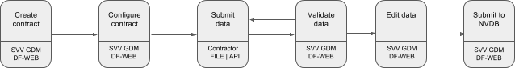

# Datafangst

Datafangst er et web-basert system for innsending, kontroll, redigering, og på sikt direkte registrering i [NVDB](http://www.vegvesen.no/fag/Teknologi/Nasjonal+vegdatabank).
Systemet skal ta i mot - GPS-stedfestede data - for alle vegobjekter konstruert ([eller endret](#endredeobjekter))
 under et vegbyggingsprosjekt.

Entrepenører er pålagt å levere data fra vegprosjekter til Statens Vegvesen for registrering i NVDB. Data fra entrepenørene
 må kvalitetssikret og etterbehandles før de kan skrives til NVDB.

I Datafangst kan entrepenører laste opp SOSI-filer og få dem validert mot [Datakatalogen](http://www.vegvesen.no/fag/Teknologi/Nasjonal+vegdatabank/Datakatalogen),
men den endelige registreringen av dataene til NVDB må gjøres av dataforvaltere hos Statens Vegvesen.

Tradisjonelt har data blitt levert på [SOSI-format](http://www.kartverket.no/sosi/).
I tillegg til å støtte opplasting av SOSI-filer til NVDB og [FKB](http://www.kartverket.no/kart/kartdata/vektorkart/fkb/),
har Datafangst også et API for å sende inn vegobjekter som  [geoJSON](http://geojson.org) - dette APIet vil bli beskrevet i dette dokumentet.

## Docker
Det er mulig å starte en versjon av [Datafangst lokalt med Docker](https://hub.docker.com/r/nvdbapnevegdata/nvdb-datafangst/).
Denne starter Datafangst-webapplikasjonen og Skrive-APIet lokalt, så du kan test både API og web-grensesnitt. 

## Definisjoner
Før vi beskriver normal arbeidsflyt i Datafangst og APIet definerer vi noen termer som er brukt i NVDB-domenet. Engelsk oversettelse i parantes.
* Kontrakt (contract) - Alle data hører til en kontrakt som representerer den faktiske kontrakten de innsamlede data tilhører. En kontrakt har
 et navn, en [objektliste](http://www.vegvesen.no/fag/Teknologi/Nasjonal+vegdatabank/Objektliste), og flere valgfri felter for å stedfeste og beskrive den.
* Vegobjekt-type (featuretype) - Alle vegobjekter tilhører en vegobjekt-type. Denne er definert i Datakatalogen, og definerer alle
 attributter objektet har, påkrevd-nivå, og relasjoner til andre vegobjekt-typer. Et eksempel på en vegobjekt-type er «Fartsgrense».
* Vegobjekt (feature) - en instans av en vegobjekt-type, for eksempel en enkelt fartsgrense.


## Roller og tilganger i Datafangst

### Dataforvalter
* Kun Vegvesenbrukere
* Kan opprette og konfigurere kontrakter
* Kan være kontraktseier
* Kan legge til andre brukere på en kontrakt
* Kan godkjenne og underkjenne innsendte data

### Medlem på kontrakt
* Både Vegvesenbrukere og eksterne brukere
* Kan sende inn data på eksisterende kontrakt
* Kan se innsendte data
* Kan redigere innsendte data
* Kan kommentere på innsendte data
* Kan se oversiktsstatus for innsendte data

## Dataflyt i Datafangst


Innsending av data og eventuell registrering av «Ferdigvegsdata» følger en definert arbeidsflyt som nå vil bli beskrevet.

1. Dataforvalter oppretter en kontrakt i webgrensesnittet.
2. Dataforvalter konfigurerer kontrakten ved å definere dens objektliste og hvilke brukere som skal ha tilgang til den.
3. Data lastes opp til kontrakten via nettleser eller API.
4. Innsendte data blir validert aynkront. Webgrensesnittet poller etter endringer og viser en spinner, ved bruk at API
 må en selv håndtere polling.
 De valideringer som blir gjort er blant andre attributt- og geometrivalidering mot Datakatalogen.
  Det blir også utført automatisk stedfesting på vegnettet, men denne informasjonen er bare tilgjengelig for dataforvaltere
  i webgrensesnittet,
5. Gjennomgang av innsendte data, dataforvalter går gjennom data i webgrensesnittet. Entrepenører er ikke påkrevd å levere alle
 attributter som er påkrevd for registrering i NVDB, disse attributtene må Dataforvalter legge til etter innsending.
 Dataforvalter og andre prosjektdeltakere har mulighet til å legge til kommentarer på alle vegobjekter og vegobjekttyper,
 samt overordnede kommentarer for kontrakten. Dataforvalter har mulighet til å markere kommentarer som feil som innsender
 må ordne og deretter sende inn de aktuelle vegobjektene på nytt.
6. Registrering til NVDB. Når alle data er godkjent og eventuelle valideringsfeil er rettet kan de sendes til NVDB.
 Denne opersjonen er bare delvis støttet i Datafangst per oktober 2016, så nåværende NVDB-registrering innebærer å
 eksportere de komplette data som SOSI og registrere ved hjelp av et av de «klassiske» applikasjonene.

# Datafangst API
Datafangst har et API som støtter geoJSON.

## Forutsetninger
* Kontraktid - nåværende versjon støtter kun operasjoner på eksisterende kontrakter som er opprettet i webgrensesnittet.
* Brukernavn og passord - Brukere kan opprettes fritt, men for å få tilgang til en gitt kontrakt må brukeren legges til
 i denne kontraktens brukere.

## Operasjoner


|Sti|Verb|Beskrivelse|
|-|-|
|api/v1/contract/|GET|Gir deg liste over alle kontraktsid'er + navn du har tilgang til|
|api/v1/contract/{id}/|GET|Gir deg informasjon om kontrakten, herunder også tilgang til objektlista for kontrakten|
|/api/v1/contract/{kontraktsid}/featurecollection|POST|POST en komplett «feature collection» til en kontrakt. Behandling og validering tar noe tid, derfor er denne operasjonen aynkron. Responser: 202 Accepted + payload med URI for polling av status.|
|/api/v1/contract/{contractId}/featurecollection/{collectionId}|GET|Henter oppgitt feature collection. Responser: 200 OK + payload med feature collection som geoJSON|
|/api/v1/contract/{contractId}/featurecollection/{featurecollectionid}|PUT|Erstatt den oppgitte feature collection Responser: 202 Accepted + payload med URI for polling av status.|
|/api/v1/contract/{contractId}/featurecollection/{featurecollectionid}/status|GET|Hent prosesseringsstatus for innsendt feature collection. Respons er json eller xml avhengig av klientens *Accept*-header. Responser: 200 OK + Payload|
|/api/v1/contract/{contractId}/featurecollection/{featurecollectionid}/feature|POST|POST et enkelt vegobjekt som geoJSON-feature. Responser: 200 OK + Payload med valideringsstatus for vegobjektet.|    |
|/api/v1/contract/{contractId}/featurecollection/{featurecollectionid}/feature/{featureId}|GET|Hent et enkelt vegobjekt. Responser: 200 OK + Payload med vegobjekt som geoJSON feature|
|/api/v1/contract/{contractId}/featurecollection/{featurecollectionid}/feature/{featureId}|PUT|Erstatt oppgitt vegobjekt. Responser: 200 OK + Payload med valideringsstatus for vegobjektet.|
|/api/v1/contract/{contractId}/featurecollection/{featurecollectionid}/feature/{featureId}|DELETE|Slett oppgitt vegobjekt Responser: 204 No content om sletting var vellykket|


Alle operasjoner returnerer med 404 Not found dersom objektet med den oppgitte id ikke finnes. Om brukeren ikke er innlogget eller ikke har tilgang til kontraktet returnerer henholdsvis 401 Unauthorized og 403 Forbidden. Dersom innsendt payload ikke er velformet geoJSON vil 400 Bad request bli returnert.

Alle POST og PUT må ha Content-Type application/geo+json

## Format

Datafangst-APIet bruker [geoJSON](https://tools.ietf.org/html/rfc7946) som payload-format.
```json
{
"type": "FeatureCollection",
  "features": [
    {
      "type": "Feature",
      "geometry": {
        "type": "Polygon",
        "coordinates": [
          [ [10.39241731, 63.43053048],
            [10.39495434, 63.43043698],
            [10.39579151, 63.42898665],
            [10.39272171, 63.42909269],
            [10.39241731, 63.43053048] ]
        ]
      },
      "properties": {
        "tag": "Forsterkningslag#1",
        "dataCatalogVersion": "2.06",
        "typeId": 227,
        "comment": "Usikker på måledatoen",
        "attributes": {
          "5543": "20160802"
         }
       }
    }
  ]
}
```

Geometriseksjonen i dette objektet er standard geoJSON. *properties* delen av objektet inneholder de attributtene som hører til vegobjektet.

### Properties
* tag (påkrevd)- Dette er et navn på vegobjektet som er ment brukt for å gjøre det lettere å referere til objekter, og lett identifisere dem med et lettlest navn.
* dataCatalogVersion (påkrevd) - Hvilken versjon av Datakatalogen som er brukt som grunnlag ved opprettelse av objektet. Siste versjonsnummer  finner man på https://www.vegvesen.no/nvdb/api/v2/status.json. Datakatalogdefinisjoner er tilgjengelige på https://www.vegvesen.no/nvdb/api/v2/vegobjekttyper/{FeatureTypeId}.json og http://labs.vegdata.no/nvdb-datakatalog
* typeId (påkrevd) - Id for vegobjekttypen dette vegobjektet er en instans av
* comment - kommentar for vegobjektet
* attributes (påkrevd) - NVDB-attributtene for vegobjektet på format "attributtid" : "verdi". Datakatalogversjonen definerer hva som er påkrevde attributter, så dersom påkrevde attributter som mangler vil gi valideringsfeil ved Datakatalog-validering.

## Endring av eksisterende vegobjekter i Datafangst<a name="endredeobjekter"></a>
 Per oktober 2016 er det kun støtte for nye objekter i Datafangst, endringer på objekter som allerede finnes i NVDB er ikke mulig. Støtte for å inkludere eksisterende objekter er planlagt tidlig høst 2017.

Properties-elementet vil da få følgende nye elementer:

```json
        "nvdbId": 'id',
        "nvdbVersion": 'versjonsid',
        "operation": "CORRECT" eller "DELETE"

```

[Postman collection for API-operasjoner](https://www.getpostman.com/collections/ef3fc73342f94df0585d)
