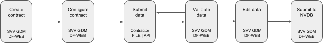

## Nye datafangst 

En helt ny versjon av Datafangst (Datafangst 2.0) er lansert, totalt nyskrevet fra scratch. Denne versjonen er p.t. (per august 2023) IKKE 
klar til å overta alle produksjonsoppgaver, men interesserte kan prøve ut ny arbeidsflyt med reelle produksjonsdata. 
Hvis man holder seg innenfor løsningens begrensninger (f.eks små datasett) så fungerer den nye løsningen bra. For eksempel kan man 
laste opp små datasett med nye objekt, gjøre  stedfesting til vegnett, opprette relasjoner (kalt sammenkobling) og lagre til NVDB. 

Lenke til nye Datafangst: [https://datafangst.atlas.vegvesen.no](https://datafangst.atlas.vegvesen.no) 

Den nye løsningen, inklusive API dokumentasjon (swagger) er beskrevet her: [https://nvdb.atlas.vegvesen.no/docs/produkter/datafang/](https://nvdb.atlas.vegvesen.no/docs/produkter/datafang/)

Både brukerdokumentasjon og API dokumentasjon er p.t. noe uferdig, men vil raskt bli bedre. 

Den nye løsningen er under aktiv utvikling og vil få mere funksjonalitet,  bli mer robust mot datafeil i NVDB og en hel rekke andre ting. 
Grunnprinsippene for tilgang til NVDB og hvordan data skal lastes opp og bearbeides er likt, men implementasjon og API er selvfølgelig ikke likt. 

Resten av dette dokumenet beskriver Datafangst 1.0, som fremdeles har hovedtyngden av produksjonsoppgaver. 

## Om Datafangst

Datafangst er et web-basert system for innsending, kontroll, redigering, og registrering i [NVDB](http://www.vegvesen.no/fag/Teknologi/Nasjonal+vegdatabank).
Systemet tar i mot GPS-stedfestede data for alle vegobjekter konstruert eller endret
 under et vegbyggingsprosjekt.

Entrepenører er pålagt å levere data fra vegprosjekter til Statens Vegvesen for registrering i NVDB. Data fra entrepenørene 
 må kvalitetssikret og etterbehandles før de kan skrives til NVDB.

I Datafangst kan entrepenører laste opp SOSI-filer og få dem validert mot [Datakatalogen](http://www.vegvesen.no/fag/Teknologi/Nasjonal+vegdatabank/Datakatalogen), 
men den endelige registreringen av dataene til NVDB må gjøres av dataforvaltere hos Statens Vegvesen.

Release notes for Datafangst oppdateres [her](https://nvdb-vegdata.github.io/endringslogg/datafangst.html).

Tradisjonelt har data blitt levert på [SOSI-format](http://www.kartverket.no/sosi/). 
I tillegg til å støtte opplasting av SOSI-filer til NVDB og [FKB](http://www.kartverket.no/kart/kartdata/vektorkart/fkb/),
har Datafangst også et API for å sende inn vegobjekter som  [geoJSON](http://geojson.org),
se [Datafangst-API](datafangst-api.md).

### Definisjoner
Før vi beskriver normal arbeidsflyt i Datafangst og APIet definerer vi noen termer som er brukt i NVDB-domenet. Engelsk oversettelse i parantes.
* Kontrakt (contract) - Alle data hører til en kontrakt som representerer den faktiske kontrakten de innsamlede data tilhører. En kontrakt har 
 et navn, en [objektliste](http://www.vegvesen.no/fag/Teknologi/Nasjonal+vegdatabank/Objektliste), og flere valgfri felter for å stedfeste og beskrive den.
* Vegobjekt-type (featuretype) - Alle vegobjekter tilhører en vegobjekt-type. Denne er definert i Datakatalogen, og definerer alle 
 attributter objektet har, påkrevd-nivå, og relasjoner til andre vegobjekt-typer. Et eksempel på en vegobjekt-type er «Fartsgrense».
* Vegobjekt (feature) - en instans av en vegobjekt-type, for eksempel en enkelt fartsgrense.

### Roller og tilganger i Datafangst

#### Dataforvalter
* Kun Statens Vegvesen, fylkeskommuner og kommuner 
* Kan opprette og konfigurere kontrakter
* Kan være kontraktseier
* Kan legge til andre brukere på en kontrakt
* Kan godkjenne og underkjenne innsendte data

#### Medlem på kontrakt
* Både Vegvesenbrukere og eksterne brukere
* Kan sende inn data på eksisterende kontrakt
* Kan se innsendte data
* Kan redigere innsendte data
* Kan kommentere på innsendte data
* Kan se oversiktsstatus for innsendte data

Oppretting av Datafangst-bruker kan gjøres fritt i Statens Vegvesen. Brukere i fylkeskommune og kommune som skal
ha bruker må ta kontakt med sin IT-organisasjon. Brukere som kun skal laste opp data på en kontrakt inviteres
med på den enkelte kontrakt av den ansvarlige for kontrakt. 

### Dataflyt i Datafangst

Innsending av data og eventuell registrering av «Ferdigvegsdata» følger en definert arbeidsflyt som nå vil bli beskrevet.

1. Dataforvalter oppretter en kontrakt i webgrensesnittet.
2. Dataforvalter konfigurerer kontrakten ved å definere dens objektliste og hvilke brukere som skal ha tilgang til den.
3. Data lastes opp til kontrakten via nettleser eller API.
4. Innsendte data blir validert synkront. Webgrensesnittet poller etter endringer og viser en spinner, ved bruk at API 
 må en selv håndtere polling.
 De valideringer som blir gjort er blant andre attributt- og geometrivalidering mot Datakatalogen. 
  Det blir også utført automatisk stedfesting på vegnettet, men denne informasjonen er bare tilgjengelig for dataforvaltere 
  i webgrensesnittet,
5. Gjennomgang av innsendte data, dataforvalter går gjennom data i webgrensesnittet. Entrepenører er ikke påkrevd å levere alle
 attributter som er påkrevd for registrering i NVDB, disse attributtene må Dataforvalter legge til etter innsending. 
 Dataforvalter og andre prosjektdeltakere har mulighet til å legge til kommentarer på alle vegobjekter og vegobjekttyper, 
 samt overordnede kommentarer for kontrakten. Dataforvalter har mulighet til å markere kommentarer som feil som innsender 
 må ordne og deretter sende inn de aktuelle vegobjektene på nytt.
6. Om den automatiske stedfestingen av objekter ikke er konklusiv må dataforvalter utføre denne manuelt. Objekter som hører sammen 
(f eks en skiltplate sitter alltid på et skiltpunkt) må kobles sammen av dataforvalter. 
7. Registrering til NVDB. Når alle data er godkjent og eventuelle valideringsfeil er rettet kan de sendes til NVDB. 
 Denne opersjonen er ikke enda fullt støttet i Datafangst per oktober 2017, men den vil komme på neste release, som er godt på vei.
