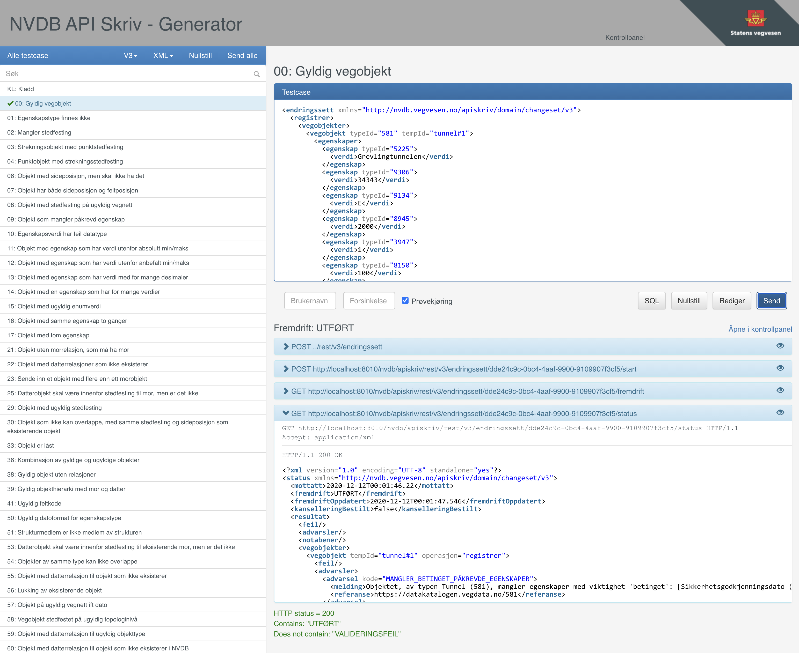

## Generator

Generator er en testklient for NVDB API Skriv. Dette er en webapplikasjon som eksponeres av NVDB API Skriv sammen med øvrige REST-endepunkter.
I applikasjonen kan man sende inn forhåndsdefinerte test case, observere arbeidsflyten under behandling og til slutt inspisere behandlingsresultatet.

### Test case

