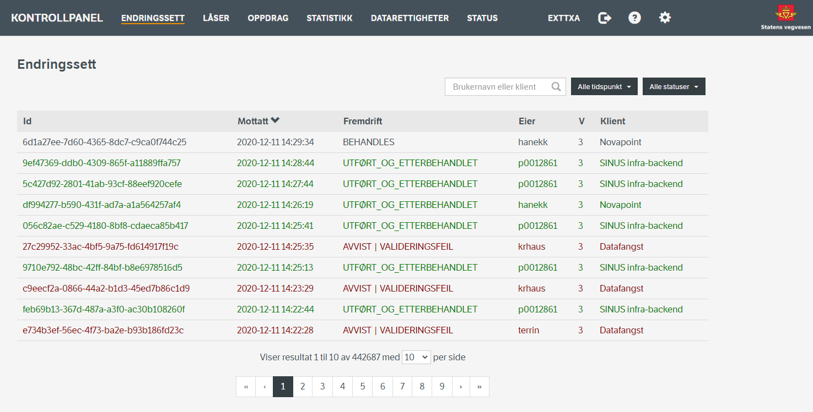

## Kontrollpanel

Kontrollpanel er NVDB API Skriv sin administrasjonsklient. Dette er en webapplikasjon som eksponeres av NVDB API Skriv sammen med øvrige REST-endepunkter.
I applikasjonen kan man se på systemstatus, overvåke behandling av endringssett, undersøke sentrale data i NVDB, samt redigere tilgangsrettigheter og systeminnstillinger.
Det siste er kun tilgjengelig for brukere med 9_system_admin-rollen.

Ved å klikke på elementene i den horisontale menyen øverst i skjermbildet aktiveres ulike faner.

### Endringssett

I denne fanen vises en oversikt over registrerte endringssett. En bruker som bare har rollen [0_bruker_fagdata](tilgangskontroll.md#tilgang-til-endepunkter-og-ressurser) 
vil kun se egne endringssett i listen. Brukere med roller av høyere orden vil derimot se samtlige endringssett. Listen av endringssett kan filtreres på eier, klient, tidsrom
for registrering og fremdriftskode. Dersom fremdriftskoden VENTER velges, kan man i tillegg velge venteårsak som filter. Tilsvarende, dersom man velger AVVIST som fremdriftskode
kan man velge avvistårsak som filter.

Ved å klikke ett av innslagene i listen får man en detaljvisning av det valgte endringssettet, inkludert behandlingsresultat med varsler og hendelseslogg. Dersom endringssettet har en fremdriftskode
som tillater kansellering vil det finnes en Kanseller-knapp. Tilsvarende, dersom endringssettet har en fremdriftskode som tillater restart av behandling vil det finnes en Start på nytt-knapp.

### Låser

I denne fanen vises en oversikt over alle låser i NVDB. Samtlige låser vises for alle brukere uavhengig av hvilke roller man har. Listen av låser kan filtreres på eier, enten ved å angi brukernavn eller fullt navn.
Lengst til venstre på hver linje i listen vises et slette-ikon, dersom brukeren har rettighet til å slette låsen. En bruker med rollen 0_bruker_fagdata, kan bare slette låser han/hun har etablert selv.
En bruker med rollen 9_system_admin kan slette alle låser.

Ved å klikke ett av innslagene i listen får man en detaljvisning av den valgte låsen. En Fjern lås-knapp er tilgjengelig dersom brukeren har tilstrekkelige roller for å slette låser.

### Oppdrag

I denne fanen vises en oversikt over alle oppdrag (tasks) i NVDB. Samtlige oppdrag vises for alle brukere uavhengig av hvilke roller man har. Listen av oppdrag kan filtreres på eier (enten ved å angi brukernavn eller fullt navn), tidsrom
for registrering og tjenesteregel. Det er mulig å gå til egen side for søk direkte i transaksjon ved å klikke lenken Søk i transaksjoner.

Ved å klikke ett av innslagene i listen får man en detaljvisning av det valgte oppdraget. For å se på transaksjonene tilknyttet oppdrag kan man klikke lenken Transaksjoner.

#### Transaksjoner

Dette er underside av Oppdrag som lister ut alle transaksjoner i NVDB som tilfredstiller noen søkekriterier. Man kan søke på eier av oppdraget transaksjonene tilhører (enten ved å angi brukernavn eller fullt navn),
oppdragsid, endringssettid, nettelementid eller vegobjektid. Det er ikke anledning til å søke på eier alene.

Listen med søketreff viser en oppsummering av innholdet i transaksjonene. Ved å klikke på den vertikalstilte V-en til venstre vises alle detaljer om innholdet i transaksjonen. 

### Statistikk

I denne fanen vises statistikk over behandlede vegobjekter samlet fra alle utførte endringssett. En bruker som bare har rollen 0_bruker_fagdata vil kun se statistikk fra egne endringssett. Brukere med roller av høyere orden vil
derimot se statistikk fra samtlige endringssett. Listen kan filtreres på brukernavn, tidsrom og vegobjektoperasjon.

### Datarettigheter

I denne fanen vises en oversikt over alle brukere i Statens vegvesen som har fått datarettigheter i NVDB API Skriv. Denne fanen er bare tilgjengelig for brukere med rollen 9_system_admin. Listen kan filtrers på brukernavn eller
for-/etternavn. Datarettighet for en ny vegvesen-bruker kan registreres ved å klikke Ny bruker. Man får da muligheten til å kopiere datarettighetene til en annen bruker. Lengst til venstre på hver linje i listen vises et slette-ikon
for å slette alle datarettigheter for denne brukeren. Ved sletting fjernes ikke brukeren eller dennes roller fra Statens vegvesen sitt LDAP-register.

Ved å klikke ett av innslagene i listen får man en detaljvisning av den valgte brukerens datarettigheter med mulighet for redigering.

### Status

I denne fanen vises informasjon relatert til driftsstatus, byggeinformasjon og datakatalogen.

### Innstillinger

Dersom man har rollen 9_system_admin kan man klikke på tannhjulet øverst til høyre for redigere systeminnstillinger. Disse fordeler seg på fire grupper:

* Valideringsparametere - Angir terskelverdier og andre parametere som regulerer valideringen av endringssett.
* CORS-headere - Angir domener som skal inkluderes i Access-Control-Allow-Origin headeren i responser fra NVDB API Skriv.
* Blokkerte vegobjekttyper for endringssett - Angir hvilke vegobjekttyper som ikke kan benyttes i endringssett.
* Blokkerte vegobjekttyper for les - Angir hvilke vegobjekttyper som ikke kan hentes via NVDB API Skriv.
* Vegobjekttyper relatert til vegnett - Angir hvilke vegobjekttyper som ansees som vegnettrelatert og dermed har noen spesielle restriksjoner.
